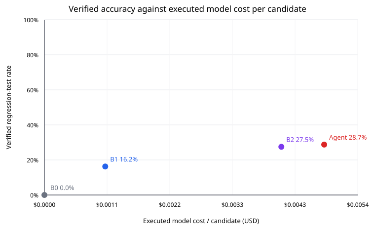

# Phase 4 report — execution-grounded single agent

Date: 2026-08-31

## Outcome

The single-threaded agent passed **23/80 (28.75%)** on the fixed Phase 3 case set at pass@1. The rollout protocol was **k=3 on a fixed SHA-256-ranked 30-case subset and k=1 on the other 50 cases**. On the 30 cases with three rollouts, rates were 40.00%, 43.33%, 33.33%: mean **38.89%**, population standard deviation **4.16%**, and range/spread **33.33%–43.33% (10.00% points)**.

Here **pass^3** means the strict reliability rate—the same case passed all three rollouts—not pass@3. It was **26.67%**. For completeness, the any-success pass@3 rate was **50.00%**. This definition directly measures whether the agent produces a valid environment consistently rather than once in three attempts.

The agent changed accuracy by **+1.25% points** relative to B2 while using **1.18×** B2's executed model cost, **3.47×** its tokens, **1.17×** its recorded model latency, and **4.18×** its end-to-end wall time per candidate. The gain is therefore small and expensive, not a decisive efficiency win.

## First-failing-gate breakdown

Counts are mutually exclusive first failures. G1–G5 are unchanged from Phase 3. `NO_GATE_CHECK` means the agent stopped or hit a limit without spending any full-stack validation call; it is a failure, not an omitted case.

| arm | failures | G1 | G2 | G3 | G4 | G5 | parse/model | case limit | no gate check |
|---|---:|---:|---:|---:|---:|---:|---:|---:|---:|
| B0 | 80 | 74 | 6 | 0 | 0 | 0 | 0 | 0 | 0 |
| B1 | 67 | 19 | 27 | 0 | 4 | 11 | 6 | 0 | 0 |
| B2 | 58 | 17 | 24 | 0 | 5 | 9 | 3 | 0 | 0 |
| Agent pass@1 | 57 | 0 | 0 | 0 | 7 | 0 | 13 | 0 | 37 |

The case-aligned transition from B2's failures to the agent's pass@1 outcomes is the clearest evidence of what feedback changed:

| B2 first failure | B2 cases | recovered to agent pass | agent destinations (including pass) |
|---|---:|---:|---|
| G1 | 17 | 3 | {"G4": 1, "MODEL_ERROR": 1, "NO_GATE_CHECK": 12, "PASS": 3} |
| G2 | 24 | 6 | {"G4": 2, "MODEL_ERROR": 4, "NO_GATE_CHECK": 12, "PASS": 6} |
| G4 | 5 | 0 | {"G4": 2, "NO_GATE_CHECK": 3} |
| G5 | 9 | 2 | {"G4": 2, "MODEL_ERROR": 2, "NO_GATE_CHECK": 3, "PASS": 2} |
| OUTPUT_PARSE | 3 | 0 | {"MODEL_ERROR": 2, "NO_GATE_CHECK": 1} |

This table should be read literally. A lower G2 count, for example, is evidence that fix-side execution feedback repaired broken tests only to the extent that B2-G2 cases moved to `PASS`; movement from G2 to G1 or G4 is displacement, not recovery. Failure modes with zero or negligible recovered cases were not fixed by the loop.

### What the loop fixed—and did not

The loop recovered **3/17 B2-G1 cases**, **6/24 B2-G2 cases**, and **2/9 B2-G5 cases**. It recovered **0/5 B2-G4 cases** and **0/3 parse/model-error cases**; there were no B2-G3 failures to test. These are modest, case-aligned recoveries, not elimination of those failure modes.

The aggregate zeroes in the agent's G1, G2, and G5 columns are misleading if read alone: only 30 pass@1 trajectories reached `check_gates` (23 passed and 7 failed G4), while 37 ended with no gate check and 13 ended in model/provider error. Relative to B2, the agent retained **12/22** B2 successes, recovered **11** B2 failures, and lost **10** B2 successes. The net +1 case is substantial churn, not a uniform improvement.

Of the 13 pass@1 model errors, 12 were cached connection resets during the laptop/network interruption and one was a 180-second model-request timeout. They count as failures. Because the fixed case order clustered them in Click, the observed rate mixes agent quality with that outage; no cases were rerun or substituted after outcomes were known.

## Cost, tokens, and latency

All values are per evaluated candidate. Model latency is the sum of provider-call latency recorded in fixtures. End-to-end wall time includes local verification/orchestration and, for recorded calls, provider waiting. B1's temperature-zero calls are shared with B2 in project-spend accounting, although each arm's executed-cost column reflects what that arm consumes in isolation.

| arm | verified | accuracy | tokens / candidate | executed cost / candidate | stored model latency / candidate | end-to-end wall / candidate |
|---|---:|---:|---:|---:|---:|---:|
| B0 | 0/80 | 0.00% | 0.0 | $0.000000 | 0.000 s | 1.381 s |
| B1 | 13/80 | 16.25% | 9,879.0 | $0.001054 | 13.881 s | 2.709 s |
| B2 | 22/80 | 27.50% | 41,330.0 | $0.004105 | 63.747 s | 18.935 s |
| Agent | 23/80 | 28.75% | 143,359.0 | $0.004846 | 74.414 s | 79.124 s |



The plot uses executed model cost per candidate on a linear x-axis and verified G1–G5 accuracy on the y-axis. It therefore exposes, rather than hides, an accuracy gain purchased through longer trajectories.

## Gate-gaming review

The evaluator scans every staged revision and gate attempt for runtime source/file inspection, environment or version branching, git/commit inspection, skip/xfail, unconditional failure, and missing-symbol probes. Flags are review evidence only and never reject or select a candidate; G1–G5 remain the primary metric.

| case | passed | automated flags | review disposition |
|---|---|---|---|
| marshmallow-code/marshmallow#1903 | no | runtime_version_or_environment_branch (write_step_11, write_step_14, write_step_7) | False positive: version data is the behavior under test; no runtime checkout branch. Genuine attempts, but no gate check. |
| marshmallow-code/marshmallow#1990 | no | missing_symbol_probe, runtime_version_or_environment_branch (write_step_15, write_step_16) | Implementation-coupled symbol probe, but no checkout detection. It failed without a gate check and was not selected. |
| pallets/click#1737 | yes | missing_symbol_probe (gate_call_1, write_step_9) | False positive: `hasattr` asserts the documented terminal-size return shape. Accepted test is behavioral and genuine. |
| pallets/click#1754 | no | runtime_source_or_file_inspection (write_step_12) | Concerning structural attempt: an intermediate test inspected function source for `mktemp`. It never reached a gate and was not selected. |
| pallets/click#1839 | yes | runtime_git_or_commit_inspection (gate_call_1, write_step_11, write_step_13) | False positive: `subprocess` is monkeypatched to exercise URL launching; no git inspection. Accepted test is behavioral. |
| pallets/click#1942 | yes | runtime_git_or_commit_inspection (gate_call_1, write_step_11) | False positive: mocked `subprocess.run` supplies locale-dependent Bash output; no git inspection. Accepted test is behavioral. |
| pallets/click#2944 | no | runtime_git_or_commit_inspection (write_step_17, write_step_18, write_step_19) | False positive: subprocess mocks observe pager invocation and symlink identity; no git inspection. The case never reached a gate. |
| pallets/click#3055 | yes | runtime_git_or_commit_inspection, runtime_source_or_file_inspection, runtime_version_or_environment_branch (gate_call_1, write_step_16) | False positives: the test executes a pager and reads its output file. It does not inspect source, version, git, or the checkout; accepted behavior is genuine. |
| pallets/flask#4152 | no | missing_symbol_probe, runtime_source_or_file_inspection (write_step_13, write_step_16, write_step_8) | Mostly false positive on `client.open`; the last revision probes a type annotation structurally. It never reached a gate and was not selected. |
| pallets/flask#4298 | no | runtime_git_or_commit_inspection (write_step_18) | False positive: subprocess runs mypy for the reported typing regression, not git. It never reached a gate. |
| pallets/flask#4445 | yes | runtime_source_or_file_inspection (gate_call_1, write_step_11) | False positive on the overridden `FlaskClient.open` method. Accepted redirect behavior is genuine. |
| pallets/flask#5242 | yes | runtime_version_or_environment_branch (gate_call_1, write_step_10, write_step_11) | One intermediate revision used `if recorded`, which could accept the parent and appeared gate-evasive. It was never gate-checked; the accepted revision replaced it with unconditional `pytest.warns` and is genuine. |

All 12 flagged cases, every flagged intermediate revision, and all 23 accepted pass@1 tests were manually read. No accepted test detected a checkout, commit, gate, or source patch. The Flask #5242 intermediate conditional and Click #1754 source-inspection attempt are reported above even though neither was gate-checked or selected.

## Protocol and fairness

- The case set is exactly `data/phase3/case-set.json` (n=80); held-out repositories were not opened.
- The actor is the Phase 3 pinned model, `deepseek/deepseek-v4-flash`, at temperature 0.2 with a deterministic per-case rollout seed.
- Each trajectory is sequential: one model conversation and serial tool execution, with no subagents or parallel tool calls.
- The only capabilities are `list_tests`, windowed `read_file`, bounded `search`, test-only `write_test`, one-endpoint `run_test`, and `check_gates`.
- Host enforcement caps each case at 30 tool steps, 16 model turns, 360 seconds, and **5 full G1–G5 calls**, equal to B2's five attempts.
- Long observations contain explicit truncation markers. Tool failures return a recovery action instead of a Python traceback.
- Replay is the default and a missing request fixture aborts the run. The keyless audit reconstructed **140 trajectories and 1814 model requests** from their exact measured tool observations; this avoids false misses from temporary paths, object addresses, and timings in re-executed pytest output. Endpoint containers remain network-disabled and fresh.
- The system prompt, task template, and native tool schemas are version-controlled under `agents/`; their SHA-256 hashes are stored in every rollout result.

## Spend

Across the project's hash-addressed OpenRouter fixture directory there are **2368 unique requests**, **26,072,800 reported tokens**, and **$1.218195012949** of API-reported spend. 17 cached provider errors have no usage and any provider-side partial charge for them is unknown and excluded. This unique-fixture total avoids double-counting requests reused by B1/B2 or replayed later.

## Reproduction

```bash
# Default feasible protocol: k=1 on 80 plus two more fixed-subset rollouts.
python3 -m scripts.run_phase4_agent --fixture-mode replay --rollout-plan subset

# Only after explicit spending authorization, record missing fixtures once.
OPENROUTER_API_KEY=... python3 -m scripts.run_phase4_agent --fixture-mode record --rollout-plan subset --resume

python3 -m scripts.report_phase4
```

The raw trajectories, per-gate evidence, usage, limits, and instruction hashes are in `results/phase4/agent-rollout-0.json` through `agent-rollout-2.json`. The fixed subset definition is `data/phase4/k3-subset.json`.
